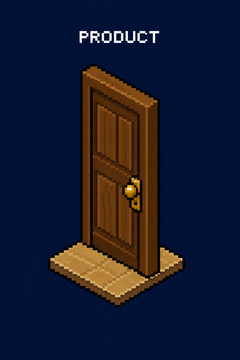
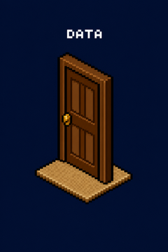
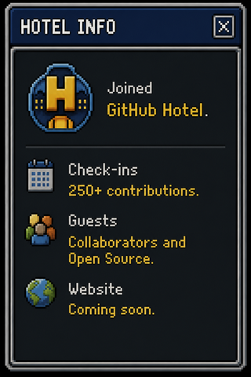

<!--
  akorra24's Habbo Hotel — GitHub profile README
  The unique visual is the full client screenshot in hotel-header.png.
  Everything below is the clickable hotel: doors, rooms, guestbook.
-->

  

<code>Click a door. Walk the rooms.</code>

---

## HOTEL DIRECTORY

<table width="100%">
  <tr>
    <td valign="top" width="20%" align="center">

Turning messy problems into simple, useful experiences.

<a href="#product-room"><code>ENTER</code></a>

    </td>
    <td valign="top" width="20%" align="center">

CS background. I like knowing how the thing actually works.

<a href="#tech-room"><code>ENTER</code></a>

    </td>
    <td valign="top" width="20%" align="center">

Metrics &gt; opinions. Measure, learn, iterate.

<a href="#data-room"><code>ENTER</code></a>

    </td>
    <td valign="top" width="20%" align="center">

Obsessed with clean, intuitive product experiences.

<a href="#design-room"><code>ENTER</code></a>

    </td>
    <td valign="top" width="20%" align="center">

Sports, movies, hiking, good food &amp; side quests.

<a href="#life-room"><code>ENTER</code></a>

    </td>
  </tr>
</table>

---

## PRODUCT ROOM

Turning customer problems into experiences people actually want to use.

Associate Product Manager. Los Angeles. I work where product, software, UX, experimentation, and data meet — and I care about whether people actually use the thing.

Product strategy. Consumer eCommerce. Discovery → delivery. Experimentation. UX. Cross-functional execution. Metrics &amp; behavioral data.

  

---

## TECH ROOM

I came into product through computer science, so I'm happiest when I can understand both the user problem and what is happening underneath the interface.

**Inventory**

`[ CODE ]` `[ APIs ]` `[ FIGMA ]` `[ DATA ]` `[ GIT ]` `[ AI ]`

Software fundamentals, frontend systems, Git/GitHub, rapid prototyping, AI-assisted development, and sitting with engineering until the thing actually works.

---

## DATA ROOM

`Metrics > opinions.`

Funnels, conversion, behavioral analytics. Turn that into a hypothesis, a test, and a decision. Launch is when the learning starts — not when the argument ends.

---

## DESIGN ROOM

Good product design should make complicated things feel obvious.

UX, wireframes, Figma, responsive experiences, prototypes — and a lot of time in the hallway between design and engineering, so the intended experience is the one that ships.

---

## PROJECT ROOMS

Rooms in progress.

**ShowMo** — What should I watch next? Discover movies and shows through your own taste and people you trust. `under construction`

**Family Plan Builder** — Making multi-line / family plan choices feel obvious.

**Apple Watch Cart** — Purchase flow work across devices, cart, and checkout.

<table>
  <tr>
    <td><a href="https://github.com/akorra24/showmo"><code>[ SHOWMO REPO ]</code></a></td>
    <td><code>[ LIVE DEMO — soon ]</code></td>
  </tr>
</table>

---

## ACHIEVEMENTS

  

---

## NOW PLAYING

  

<code>Eagles — Hotel California</code> 
Hotel radio changes frequently.

---

## LIFE ROOM

Philadelphia sports. Fantasy football. Hiking. A fishtank. A 2000s BMW. Side projects and random builds that seemed interesting at 1am.

---

## HOTEL INFO

<table width="100%">
  <tr>
    <td valign="top" width="40%" align="center">

    </td>
    <td valign="top" width="60%" align="center">

**Hotel Friends**

    </td>
  </tr>
</table>

Open Hotel Info

**Guest:** akorra24

**Class:** Associate Product Manager / Builder

**Location:** Los Angeles, CA

**Motto:** Always building.

**Mission:** Build useful things and understand why they work.

Hotel Directory Help

Click any door in the Hotel Directory to jump to that room.

---

## GUESTBOOK

Made it this far? Say hi.

<table>
  <tr>
    <td><a href="https://github.com/akorra24"><code>[ VIEW PROFILE ]</code></a></td>
    <td><a href="https://www.linkedin.com/in/YOUR_HANDLE"><code>[ SEND MESSAGE ]</code></a></td>
    <td><a href="mailto:YOUR_EMAIL"><code>[ EMAIL FRONT DESK ]</code></a></td>
  </tr>
</table>

---

  

<code>[ akorra24 has left the hotel. ]</code> 
Last checkout: probably later than I should've been awake.

