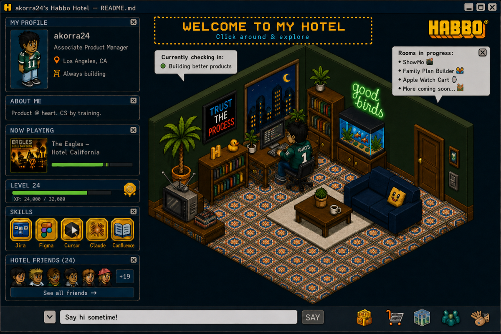
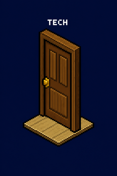
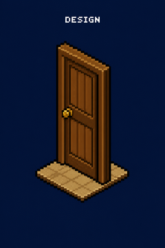
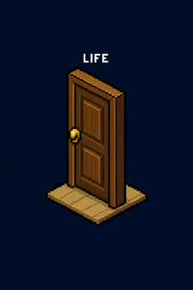
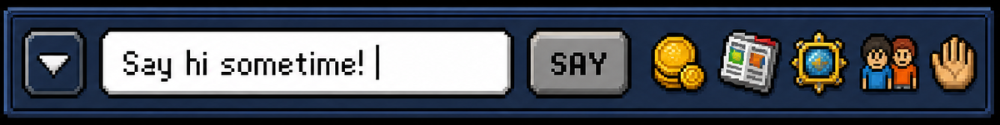

<!--
  akorra24's Habbo Hotel — GitHub profile README
  The unique visual is the full client screenshot in hotel-header.png.
-->

  

<code>Click a door. Walk the rooms.</code>

---

<a href="#product-room"><code>ENTER</code></a>

    </td>
    <td valign="top" width="25%" align="center">

CS background. I like knowing how the thing actually works.

<a href="#tech-room"><code>ENTER</code></a>

    </td>
    <td valign="top" width="25%" align="center">

Obsessed with clean, intuitive product experiences.

<a href="#design-room"><code>ENTER</code></a>

    </td>
    <td valign="top" width="25%" align="center">

Sports, movies, hiking, good food &amp; side quests.

<a href="#life-room"><code>ENTER</code></a>

    </td>
  </tr>
</table>

---

## PRODUCT ROOM

Turning customer problems into experiences people actually want to use.

Associate Product Manager. Los Angeles. I work where product, software, UX, experimentation, and data meet — and I care about whether people actually use the thing.

Product strategy. Consumer eCommerce. Discovery → delivery. Experimentation. UX. Cross-functional execution. Metrics &amp; behavioral data.

  

---

## TECH ROOM

I came into product through computer science, so I'm happiest when I can understand both the user problem and what is happening underneath the interface.

---

## DESIGN ROOM

Good product design should make complicated things feel obvious.

UX, wireframes, Figma, responsive experiences, prototypes — and a lot of time in the hallway between design and engineering, so the intended experience is the one that ships.

---

## PROGRAMS

  

---

## NOW PLAYING

  

<code>Eagles — Hotel California</code> 
Hotel radio changes frequently.

---

## LIFE ROOM

Philadelphia sports. Fantasy football. Hiking. A fishtank. A 2000s BMW. Side projects and random builds that seemed interesting at 1am.

---

  

<code>[ akorra24 has left the hotel. ]</code> 
Last checkout: probably later than I should've been awake.

